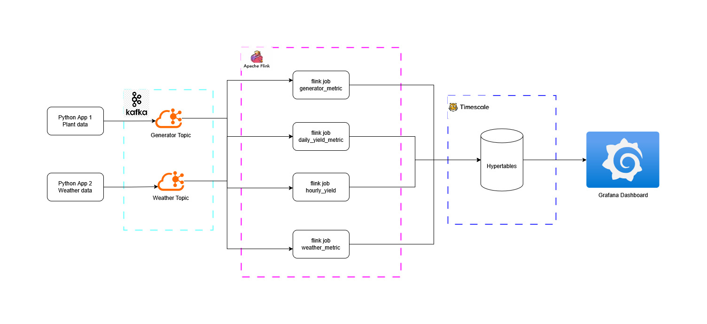
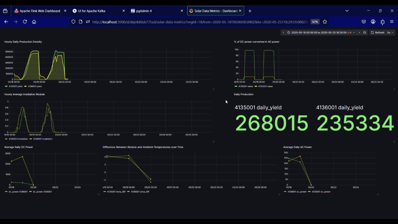

# Real-Time Solar Plant Data Streaming with PyFlink and Kafka
## 📘 Overview

This side project simulates real-time streaming of solar plant data using Python, Apache Kafka, and Apache Flink. The aim is to build an end-to-end streaming pipeline that mimics telemetry from solar power plants, with generator and environmental data ingested, processed, and made ready for downstream analytics or dashboards (e.g., Grafana).

## 🛠️ Components
- **Python Simulation Scripts**  
  Each script instance acts as a simulated solar plant. These producers emit two types of data:
  - **Generator Metrics**
  - **Weather Metrics**

- **Apache Kafka (Dockerized)**  
  Acts as the message broker. Two Kafka topics are used:
  - `generator-topic`
  - `weather-topic`

- **Apache Flink (PyFlink)**  
  Processes streaming data from Kafka. Performs aggregations, joins, time-based windowing, and calculates derived metrics.

- **TimescaleDB (PostgreSQL)**  
  Stores the processed, time-series data using hypertables for efficient query performance and storage.

- **Grafana**  
  Connects to TimescaleDB to visualize key performance indicators through interactive, real-time dashboards.

## Architecture


## 📊 Solar Plant Grafana Dashboard

This dashboard provides real-time and historical insights into solar plant performance, leveraging data processed using Apache Flink and stored in TimescaleDB.



---

### 🔍 Dashboard Metrics

- **🌞 Hourly Production Density**  
  Displays total energy generated (in kWh) per hour across all sources, normalized to area or capacity.

- **🔆 Hourly Average Irradiation (Module Level)**  
  Shows the average solar irradiation received by the modules per hour.

- **⚡ Average DC Power**  
  Computes the average direct current (DC) power output from all inverters.

- **🔌 Average AC Power**  
  Displays the average alternating current (AC) power after conversion.

- **🌡️ Module vs Ambient Temperature Difference**  
  Highlights the thermal difference between panel surface and surrounding environment — useful for thermal efficiency analysis.

- **🔁 DC to AC Conversion Efficiency (%)**  
  Shows the efficiency percentage of how much DC is successfully converted to AC.

- **📅 Daily Production**  
  Summarizes total energy generated daily by each plant/source.

- Apache Flink with PyFlink (Dockerized): A single PyFlink job consumes from both Kafka topics, performs basic transformations and enrichments, and writes to stdout or a downstream sink (e.g., file, database, or dashboard integration).

## 🧪 Use Cases
- Test Flink data processing patterns like joins, windowing, or alerts.
- Emulate real-world streaming workloads for learning or demo purposes.
- Feed a Grafana dashboard using processed metrics for live monitoring.

## Steps
- **TL;DR**
    - Get flink connectors
    - Download data
    - Run Docker compose up
    - run setup.sh
    - Start Producer

- **Download flink connectors**

    Download flink connectors for Kafka to consume data from Kafka topics. Use the below code to get connectors:
    ```bash
    mkdir -p flink-connectors
    cd flink-connectors
    curl -O https://repo1.maven.org/maven2/org/apache/flink/flink-connector-kafka/3.0.0-1.17/flink-connector-kafka-3.0.0-1.17.jar
    curl -O https://repo1.maven.org/maven2/org/apache/flink/flink-sql-connector-kafka/1.17.2/flink-sql-connector-kafka-1.17.2.jar
    ```
- **Download data and rename for plant id (optional)**

    The dataset is taken from publicaly available Kaggle Datasets. This data has been gathered at two solar power plants in India over a 34 day period. It has two pairs of files - each pair has one power generation dataset and one sensor readings dataset. The power generation datasets are gathered at the inverter level - each inverter has multiple lines of solar panels attached to it. The sensor data is gathered at a plant level - single array of sensors optimally placed at the plant.
    
    [Solar Power Generation Data](https://www.kaggle.com/datasets/anikannal/solar-power-generation-data)

- **Start all services in Docker**

    Run the following to start-up all services in docker
    ```bash
    docker-compose up
    ```

- **Topic creation on kafka**

    Create Kafka-topics for generator and weather data streams
    - Generator Topic

        ```bash
        docker exec kafka ./opt/bitnami/kafka/bin/kafka-topics.sh --create --topic generator-topic --bootstrap-server localhost:9092
        ```

    - Weather Topic

        ```bash
        docker exec kafka ./opt/bitnami/kafka/bin/kafka-topics.sh --create --topic weather-topic --bootstrap-server localhost:9092
        ```

- **Start producer job**

    Start the producer job for both Generator and Weather sensors.
    ```bash
    poetry run start-producer-generator --plant_id 4135001
    poetry run start-producer-weather  --plant_id 4135001
    ```

- **Start consumer job**

    Submit the Consumer Job
    ```bash
    docker exec jobmanager flink run --python /opt/flink/jobs/kafka-table-reader.py
    ```
    This returns a JOB_ID which can be used to stop the job.

- **Stopping the consumer Job**

    To stop the flink job
    ```bash
    docker exec jobmanager flink cancel <JOB_ID>
    ```